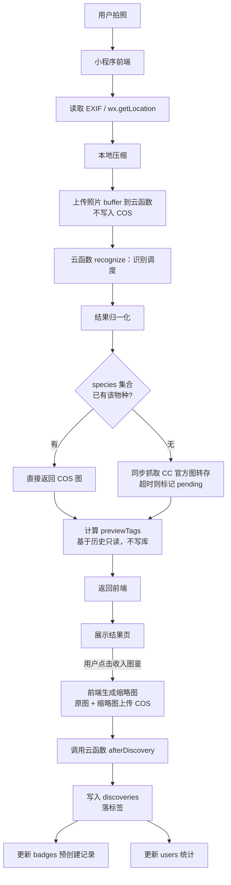

# 《好奇图鉴》技术架构文档

- 版本：v1.2
- 日期：2026-08-04
- 关联 PRD：好奇图鉴_PRD_v1.4.md

---

## 一、技术选型

### 1.1 总体架构

```
┌─────────────────────────────────────────────────────────┐
│                    微信小程序前端                         │
│  ┌─────────┐ ┌─────────┐ ┌─────────┐ ┌─────────┐        │
│  │ 首页     │ │ 结果页   │ │ 图鉴页   │ │ 我的页   │        │
│  │ (发现)   │ │(Result) │ │(Collection)│(Profile)│       │
│  └─────────┘ └─────────┘ └─────────┘ └─────────┘        │
├─────────────────────────────────────────────────────────┤
│                 微信云开发 (CloudBase)                    │
│  ┌───────────┐ ┌───────────┐ ┌───────────┐              │
│  │ 云数据库   │ │ 云存储     │ │ 云函数     │              │
│  │ (MongoDB) │ │  (COS)    │ │(Node.js 18)│             │
│  └───────────┘ └───────────┘ └───────────┘              │
├─────────────────────────────────────────────────────────┤
│                  第三方识别服务                           │
│  ┌───────────┐ ┌───────────┐ ┌───────────┐              │
│  │ 百度智能云  │ │ iNaturalist│ │ Pl@ntNet │              │
│  │ 通用+动植物 │ │  Taxa API │ │   API    │              │
│  └───────────┘ └───────────┘ └───────────┘              │
├─────────────────────────────────────────────────────────┤
│                  其他第三方服务                           │
│  ┌───────────┐ ┌───────────┐ ┌───────────┐              │
│  │ 腾讯位置   │ │ 中国生物   │ │   GBIF    │              │
│  │ 服务(逆地址)│ │名录(SP2000)│ │Species API│              │
│  └───────────┘ └───────────┘ └───────────┘              │
└─────────────────────────────────────────────────────────┘
```

### 1.2 选型理由

| 层级 | 技术方案 | 理由 |
| --- | --- | --- |
| 前端 | 微信小程序原生 | 与微信生态深度集成，相机/相册/定位 API 最成熟 |
| 后端 | 微信云开发（CloudBase） | 免服务器运维、免域名备案、与小程序一键集成、免费额度充足 |
| 数据库 | 云开发 MongoDB | 文档型，适合物种记录的灵活结构 |
| 文件存储 | 云开发云存储（COS） | 与小程序上传下载 SDK 无缝衔接 |
| 云函数 | Node.js 18 | Node.js 12 已 EOL，18 为 LTS 版本 |
| 识别服务 | 百度通用 + 百度动植物 + Pl@ntNet | 覆盖全品类，成本可控 |
| 逆地址解析 | 腾讯位置服务 | 国内服务，与微信生态兼容，需申请 key |
| 物种搜索 | iNaturalist Taxa → SP2000 → GBIF | 中文名覆盖、国内可达性、权威性综合考量 |

### 1.3 云开发免费额度（截至 2026.07）

| 资源 | 免费额度 | 说明 |
| --- | --- | --- |
| 云数据库 | 5GB 存储 | 100 万条记录绰绰有余 |
| 云存储 | 5GB 存储 | 约 1 万张 500KB 照片 |
| 云函数 | 5 万次/月调用 | 日均 1600 次 |
| 云函数外网流量 | 1GB/月 | 调用第三方 API 用 |
| CDN 流量 | 5GB/月 | 图片下载 |

超出后按量付费：数据库约 0.5 元/GB/月，云存储约 0.15 元/GB/月，云函数约 0.02 元/万次。**注意：云开发免费额度近两年有调整，以上数字以官网最新为准。**

---

## 二、数据存储方案

### 2.1 数据隔离原则

- 所有用户数据以 openid 为唯一标识过滤
- 云数据库查询必须带 openid 过滤，禁止全表查询
- 云函数中通过 `wxContext.OPENID` 获取当前用户身份，**不可由前端传入**（所有云函数统一遵守，见 5.1）

### 2.2 数据库集合设计

#### 2.2.1 users（用户档案）

```js
{
  _id: ObjectId,              // 云数据库自动生成
  openid: "wx_abc123",        // 微信 openid，唯一索引
  nickname: "好奇探索者",      // 用户昵称，可修改
  avatarEmoji: "🌿",          // 头像 emoji，可修改
  joinDate: ISODate("2026-03-15T00:00:00Z"),
  lastLogin: ISODate("2026-07-30T10:00:00Z"),
  streakCount: 12,            // 当前连续天数
  lastDiscoveryDate: ISODate("2026-07-29T00:00:00Z"),
  totalDiscoveries: 23,       // 累计发现物种数
  categoryCount: 5,           // 覆盖类别数
  createdAt: ISODate,
  updatedAt: ISODate
}
```

索引：`openid`（唯一）

> 注意：`locationEnabled` 已从 users 集合移除，仅保留在 settings 集合中。

#### 2.2.2 settings（用户设置）

```js
{
  _id: ObjectId,
  openid: "wx_abc123",
  locationEnabled: true,      // 地理位置总开关
  autoSaveToAlbum: false,     // 是否自动保存到相册（预留）
  compressQuality: 80,        // 照片压缩质量（预留）
  createdAt: ISODate,
  updatedAt: ISODate
}
```

索引：`openid`（唯一）

#### 2.2.3 discoveries（发现记录）

```js
{
  _id: ObjectId,
  openid: "wx_abc123",        // 关联用户
  speciesName: "玉带凤蝶",
  latinName: "Papilio polytes", // 拉丁名，可能为空
  speciesKey: "papilio polytes", // 归一化查重键（见 3.5 降级链），小写
  category: "昆虫",            // 枚举：昆虫/植物/鸟类/菌类/动物
  order: "鳞翅目",
  family: "凤蝶科",
  // 照片（收藏时才上传）
  userPhotoUrl: "cloud://env-id/photos/wx_abc123/20260723_1023.jpg",
  thumbUrl: "cloud://env-id/thumbs/wx_abc123/20260723_1023_thumb.jpg",
  // 科普信息
  description: "翅展约 90-120mm...",
  habitat: "常见于柑橘园...",
  // 识别元数据
  confidence: 0.94,           // 置信度；手动搜索时为 null
  source: "baidu-animal",     // 识别来源；手动搜索时为 "manual"
  isManualSearch: false,      // 是否手动搜索
  // 发现信息（仅存储文本地名，不存储精确坐标）
  location: "奥森公园",        // 逆地址解析后的文本地名，可编辑
  discoveredAt: ISODate("2026-07-23T10:23:00+08:00"),
  // 游戏化标签（收藏时落库，落库后不重算）
  rarityTags: ["首次发现", "连续 12 天"],
  isFirstDiscovery: true,
  createdAt: ISODate,
  updatedAt: ISODate
}
```

索引：

- `openid + discoveredAt`（复合索引，图鉴列表查询）
- `openid + speciesKey`（复合索引，查重）

> 注意：**不存储 locationRaw（精确经纬度）**。逆地址解析在云函数内完成，仅存储解析后的文本地名。

#### 2.2.4 badges（徽章记录）

```js
{
  _id: ObjectId,
  openid: "wx_abc123",
  badgeId: "insect_apprentice", // 徽章唯一标识
  badgeName: "昆虫学徒",
  emoji: "🦋",
  unlocked: true,
  unlockedAt: ISODate("2026-04-10T00:00:00Z"),
  progress: 5,                // 当前进度
  target: 5,                  // 目标值
  createdAt: ISODate,
  updatedAt: ISODate
}
```

索引：`openid + badgeId`（唯一复合索引）

> 初始化策略：用户首次使用时，预创建全部徽章记录（`unlocked: false, progress: 0`）。

#### 2.2.5 species（物种主档集合）

合并了原 species_metadata 和物种图片缓存功能。**全员可读，仅云函数可写。**

```js
{
  _id: ObjectId,
  speciesName: "玉带凤蝶",      // 中文名（展示用）
  latinName: "Papilio polytes", // 拉丁名（归一化键，小写存储）
  category: "昆虫",
  order: "鳞翅目",
  family: "凤蝶科",
  // 科普信息
  description: "翅展约 90-120mm...",
  habitat: "常见于柑橘园...",
  // 官方标准图（CC 授权优先）
  officialPhotoUrl: "cloud://env-id/species/papilio_polytes.jpg",
  officialPhotoStatus: "ready", // ready / pending（缓存中）/ failed
  imageSource: "iNaturalist",   // iNaturalist / Wikimedia / baidu-baike（兜底）
  imageLicense: "CC BY",        // CC BY / CC BY-SA / CC0 / 未知（百科兜底）
  originalImageUrl: "https://inaturalist-open-data.s3.amazonaws.com/...",
  // 物种元数据（v1.2 规划，v1.0 仅部分字段）
  seasonData: {                 // 出现月份（v1.2 仅 Top 几百常见物种人工补充）
    months: [4, 5, 6, 7, 8, 9],
    source: "manual_top_species",
    coverage: "partial"         // partial（仅 Top 物种）/ unknown
  },
  isNocturnal: null,            // 是否夜行性（v1.2 规划，v1.0 不填）
  iucnStatus: null,             // IUCN 等级（v1.2 规划）
  // 缓存元数据
  firstCachedAt: ISODate,
  lastUpdatedAt: ISODate,
  createdAt: ISODate,
  updatedAt: ISODate
}
```

索引：`latinName`（唯一）、`speciesName`（文本索引）

**数据来源与覆盖率说明**：

| 字段 | v1.0 状态 | 数据来源 | 覆盖率预期 |
| --- | --- | --- | --- |
| speciesName, latinName, category | 有 | 识别 API 返回 + 人工校对 | 全物种 |
| description, habitat | 有 | 百度百科 / iNaturalist | 常见物种 |
| officialPhotoUrl | 有 | iNaturalist (CC) / Wikimedia (CC) / 百度兜底 | 常见物种 |
| imageSource, imageLicense | 有 | 与 officialPhotoUrl 同步 | 常见物种 |
| seasonData | v1.2 | 人工补充 Top 几百常见物种 | 仅 Top 几百 |
| isNocturnal | v1.2 | 人工补充 Top 几百常见物种 | 仅 Top 几百 |
| iucnStatus | v1.2 | IUCN API | 仅评估物种 |

> 来源不明的字段在 v1.0 中不填充，不得承诺全物种覆盖。

**安全规则（与其他集合不同）**：

```json
{
  "read": true,   // 全员可读（用于展示官方图和科普信息）
  "write": false  // 仅云函数通过 admin 权限写入
}
```

### 2.3 云存储目录结构

```
cloud://env-id/
├── photos/                  # 用户原始照片（收藏后才上传）
│   └── {openid}/
│       ├── 20260723_102345.jpg
│       └── ...
├── thumbs/                  # 缩略图（≤100KB，用于列表）
│   └── {openid}/
│       ├── 20260723_102345_thumb.jpg
│       └── ...
└── species/                 # 物种官方标准图（CC 授权优先，全员可读）
    ├── papilio_polytes.jpg
    └── ...
```

> 注意：
> - 分享卡片由前端 canvas 生成，不占用云存储（share-cards/ 目录已移除）
> - **缩略图由前端在收藏时生成**（canvas 压缩，目标 ≤100KB），与原图一并上传

### 2.4 数据流图（两段式写库）



---

## 三、识别引擎架构

### 3.1 调度策略（v1.0，并行粗分类 + 立即路由）

```js
// 云函数：recognize.js (Node.js 18)
const cloud = require('wx-server-sdk');
cloud.init({ env: cloud.DYNAMIC_CURRENT_ENV });

exports.main = async (event, context) => {
  const { OPENID } = cloud.getWXContext(); // openid 只能从 wxContext 获取
  const { imageBuffer, location } = event;
  return recognize(imageBuffer, OPENID, location);
};

async function recognize(imageBuffer, openid, location) {
  // 1. 立即并行发起两个请求（此时均不等待）
  const generalPromise = callBaiduGeneral(imageBuffer); // 粗分类（国内，快）
  const plantPromise   = callPlantNet(imageBuffer);      // 植物专用（海外，慢）
  plantPromise.catch(() => {}); // 动物路由不消费该 promise，吞掉异常避免 unhandled rejection

  // 2. 先等百度通用，拿到粗分类立即路由
  let generalResult = null;
  try {
    generalResult = await generalPromise;
  } catch (e) {
    // 百度通用失败（rejected 分支）：退化为只用 Pl@ntNet 判定
    const plantResult = await plantPromise.catch(() => null);
    if (plantResult && plantResult.confidence >= 0.6) {
      return normalize(plantResult, { category: '植物' });
    }
    return { success: false, reason: '识别服务暂时不可用' };
  }

  // 3. 粗分类映射：百度通用返回的类别 → 五类生物（映射表见 3.2）
  const category = extractCategory(generalResult);

  // 4. 按粗分类路由
  if (category === '植物') {
    const plantResult = await plantPromise.catch(() => null); // 植物路由才等 Pl@ntNet
    if (plantResult && plantResult.confidence >= 0.6) {
      return normalize(plantResult, { category: '植物' });
    }
    const baiduPlant = await callBaiduPlant(imageBuffer);
    if (baiduPlant.confidence >= 0.6) {
      return normalize(baiduPlant, { category: '植物' });
    }
    return lowConfidenceOrFail(generalResult, '植物');
  }

  if (['昆虫', '鸟类', '动物'].includes(category)) {
    // 动物路由：不等待 Pl@ntNet，直接调百度动物识别
    const baiduAnimal = await callBaiduAnimal(imageBuffer);
    if (baiduAnimal.confidence >= 0.6) {
      return normalize(baiduAnimal, { category });
    }
    return lowConfidenceOrFail(generalResult, category);
  }

  if (category === '菌类') {
    // 菌类无专用接口，百度通用兜底，阈值 0.5
    if (generalResult.confidence >= 0.5) {
      return normalize(generalResult, { category: '菌类', note: '菌类识别仅供参考' });
    }
    return { success: false, reason: '无法识别' };
  }

  // 5. 无法分类：百度通用兜底
  return lowConfidenceOrFail(generalResult, '未知');
}

// 低置信度统一处理：专用接口不达标时，用百度通用结果兜底
// 通用 ≥ 0.5 → 返回结果并标注「识别不确定」（前端黄色提示条）
// 通用 < 0.5 → 返回识别失败（前端失败页）
function lowConfidenceOrFail(generalResult, category) {
  if (generalResult && generalResult.confidence >= 0.5) {
    return normalize(generalResult, { category, note: '识别不确定' });
  }
  return { success: false, reason: '无法识别' };
}
```

**关键规则汇总**：

| 情形 | 返回 | 前端表现 |
| --- | --- | --- |
| 专用接口置信度 ≥ 0.6 | 正常结果 | 结果页 |
| 专用接口不达标，百度通用 ≥ 0.5 | 兜底结果 + note「识别不确定」 | 结果页 + 黄色提示条 |
| 百度通用 < 0.5 或无结果 | `success: false` | 失败页（重拍/手动搜索） |
| 百度通用请求失败且 Pl@ntNet 不达标 | `success: false` | 失败页 |

### 3.2 百度通用识别 → 五类生物映射表

| 百度通用返回类别 | 映射到五类 | 说明 |
| --- | --- | --- |
| 植物 / 花卉 / 树木 / 草 | 植物 | 直接映射 |
| 昆虫 / 蝴蝶 / 蜜蜂 / 甲虫 | 昆虫 | 直接映射 |
| 鸟类 / 鸟 / 鹰 / 雀 | 鸟类 | 直接映射 |
| 哺乳动物 / 猫 / 狗 / 鼠 / 松鼠 | 动物 | 直接映射 |
| 蘑菇 / 菌类 / 真菌 | 菌类 | 直接映射 |
| 两栖动物 / 爬行动物 / 鱼 | 动物 | 归入动物大类 |
| 其他 / 无法识别 | 未知 | 走兜底路径 |

> 映射失败兜底：当百度通用返回的类别无法干净映射到五类时，直接采用百度通用识别的结果（按 3.1 阈值规则判断），不路由到专用接口。

### 3.3 结果归一化格式（含 previewTags）

无论调用哪个 API，最终返回给前端的格式统一：

```js
{
  success: true,
  species: {
    name: "玉带凤蝶",
    latinName: "Papilio polytes",  // 可能为 null
    speciesKey: "papilio polytes", // 归一化查重键（见 3.5）
    category: "昆虫",
    order: "鳞翅目",
    family: "凤蝶科"
  },
  description: "翅展约 90-120mm...",
  habitat: "常见于柑橘园...",
  officialPhotoUrl: "cloud://env-id/species/papilio_polytes.jpg", // pending 时为 null
  officialPhotoStatus: "ready",    // ready / pending / failed
  confidence: 0.94,
  source: "baidu-animal",          // plantnet / baidu-plant / baidu-animal / baidu-general
  note: null,                      // 「识别不确定」/「菌类识别仅供参考」
  // 标签预计算（基于用户历史只读，不写库）
  previewTags: [
    { type: "first_discovery", label: "🆕 首次发现", color: "green" },
    { type: "streak", label: "🔥 连续 12 天", color: "orange" }
  ],
  // 其他候选（Top-3）
  alternatives: [
    { name: "碧凤蝶", latinName: "Papilio bianor", confidence: 0.82 },
    { name: "柑橘凤蝶", latinName: "Papilio xuthus", confidence: 0.65 }
  ],
  // 发现信息
  location: "奥森公园",             // 逆地址解析结果，可能为 null
  discoveredAt: "2026-07-23T10:23:00+08:00",
  isMultiSubject: false            // v1.0 仅支持单主体
}
```

### 3.4 previewTags 计算逻辑

```js
// 云函数：previewTags.js（独立轻量云函数，只读不写库）
// 调用场景：① recognize 内部调用 ② 前端切换 Top-3 候选时单独调用
const cloud = require('wx-server-sdk');
cloud.init({ env: cloud.DYNAMIC_CURRENT_ENV });

exports.main = async (event, context) => {
  const { OPENID } = cloud.getWXContext();
  const { speciesKey, discoveredAt } = event;
  return calculatePreviewTags(OPENID, speciesKey, discoveredAt);
};

async function calculatePreviewTags(openid, speciesKey, discoveredAt) {
  const tags = [];
  // 1. 检查是否首次发现（按查重键）
  const existing = await db.collection('discoveries')
    .where({ openid, speciesKey })
    .count();
  if (existing.total === 0) {
    tags.push({ type: "first_discovery", label: "🆕 首次发现", color: "green" });
  }
  // 2. 检查 streak（时区：Asia/Shanghai，按自然日判定）
  const streak = await calculateStreak(openid, discoveredAt);
  if (streak.current >= 3) {
    tags.push({ type: "streak", label: `🔥 连续 ${streak.current} 天`, color: "orange" });
  }
  // 3. 检查夜间发现（v1.0：仅时间判定，20:00-06:00，按东八区）
  const hour = toBeijingHour(discoveredAt);
  if (hour >= 20 || hour < 6) {
    tags.push({ type: "night", label: "🌙 夜间发现", color: "purple" });
  }
  return tags;
}
```

> 注意：previewTags 仅用于结果页展示，不写库。用户点击「收入图鉴」时，相同的标签逻辑在 afterDiscovery 云函数中重新计算并落库。**前端切换 Top-3 候选时，需调用 previewTags 云函数按新物种重算标签。**

### 3.5 查重键（speciesKey）降级链

拉丁名是首选查重键，但百度返回结果不保证有拉丁名。normalize 时按以下降级链生成 `speciesKey`：

1. **拉丁名**：转小写、去首尾空格 → `speciesKey = latinName.toLowerCase()`
2. **拉丁名为空**：用中文名查 species 集合，若命中则补全拉丁名并采用
3. **仍无**：降级为 `speciesKey = 「中文名 + 科」`（如 `玉带凤蝶|凤蝶科`）

同一用户同一 speciesKey 判定为重复收藏。

---

## 四、游戏化计算（云函数）

### 4.1 计算时机

每次用户点击「收入图鉴」后，由 afterDiscovery 云函数触发计算：

```js
// 云函数：afterDiscovery.js (Node.js 18)
const cloud = require('wx-server-sdk');
cloud.init({ env: cloud.DYNAMIC_CURRENT_ENV });

exports.main = async (event, context) => {
  // openid 只能从 wxContext 获取，禁止前端传入（见 5.1）
  const { OPENID } = cloud.getWXContext();
  const { discovery } = event; // event 仅传业务数据

  // 1. 检查是否首次发现（用于查重和标签）
  const isFirst = await checkFirstDiscovery(OPENID, discovery.speciesKey);
  if (!isFirst) {
    return { success: false, reason: '已在图鉴中' }; // 重复收藏拦截
  }
  // 2. 更新 streak（只增不减策略，Asia/Shanghai 自然日）
  const streak = await updateStreak(OPENID, discovery.discoveredAt);
  // 3. 组装 rarityTags（与 previewTags 逻辑一致，但此时落库）
  const tags = [];
  if (isFirst) tags.push('首次发现');
  if (streak.current >= 3) tags.push(`连续 ${streak.current} 天`);
  const hour = toBeijingHour(discovery.discoveredAt);
  if (hour >= 20 || hour < 6) tags.push('夜间发现');
  // 4. 写入 discovery 记录（照片已在前端上传 COS）
  await db.collection('discoveries').add({
    data: { ...discovery, openid: OPENID, rarityTags: tags, isFirstDiscovery: true }
  });
  // 5. 检查徽章解锁（基于预创建的徽章记录更新进度）
  await checkBadges(OPENID, discovery, tags);
  // 6. 更新用户统计
  await updateUserStats(OPENID);
  return { success: true };
};
```

### 4.2 徽章检查逻辑（基于预创建记录）

```js
async function checkBadges(openid, discovery, tags) {
  // 读取预创建的徽章记录
  const userBadges = await db.collection('badges').where({ openid }).get();
  const toUpdate = [];
  // 初识自然
  const totalCount = await db.collection('discoveries').where({ openid }).count();
  if (totalCount.total >= 1) {
    toUpdate.push({ badgeId: 'first_nature', unlocked: true, progress: totalCount.total });
  }
  // 昆虫学徒
  if (discovery.category === '昆虫') {
    const insectCount = await countByCategory(openid, '昆虫');
    toUpdate.push({
      badgeId: 'insect_apprentice',
      unlocked: insectCount >= 5,
      progress: insectCount
    });
  }
  // 坚持不懈
  const streak = await getStreak(openid);
  if (streak >= 7) {
    toUpdate.push({ badgeId: 'persistent', unlocked: true, progress: streak });
  }
  // 夜间发现
  if (tags.includes('夜间发现')) {
    const nightCount = await countByTag(openid, '夜间发现');
    toUpdate.push({ badgeId: 'night_owl', unlocked: nightCount >= 3, progress: nightCount });
  }
  // ... 其他徽章
  await batchUpdateBadges(openid, toUpdate);
}
```

### 4.3 删除记录策略

- **streak 只增不减**：删除记录不影响已计算的 streak 天数
- **已落库的标签快照不重算**：删除记录后，历史徽章解锁状态保留
- **统计计数同步重算**：删除时调用 `updateUserStats` 重算 `totalDiscoveries` 和 `categoryCount`（仅计数更新，不涉及标签与徽章重算）

---

## 五、安全与隐私

### 5.1 数据隔离

- 云数据库查询必须带 openid 过滤，禁止全表查询
- 云函数中通过 `cloud.getWXContext().OPENID` 获取当前用户身份，**不可由前端传入**。所有云函数（recognize、afterDiscovery、manualSearch、previewTags）统一遵守：event 中禁止出现 openid 字段，如收到则忽略

### 5.2 权限控制（云数据库安全规则）

用户数据集合（users, discoveries, badges, settings）：

```json
{
  "read": "doc.openid == auth.openid",
  "write": "doc.openid == auth.openid"
}
```

物种主档集合（species）：

```json
{
  "read": true,   // 全员可读（用于展示官方图和科普信息）
  "write": false  // 仅云函数通过 admin 权限写入
}
```

### 5.3 地理位置脱敏

- 精确坐标（经纬度）仅在云函数内使用，用于调用腾讯位置服务逆地址解析
- 解析后的文本地名（如「奥森公园」）存入 `discoveries.location`
- **不存储精确坐标到数据库**
- 用户关闭地理位置后，地点字段为空

### 5.4 第三方数据共享披露

隐私政策弹窗和完整隐私政策中必须明确披露：

| 数据 | 接收方 | 用途 |
| --- | --- | --- |
| 照片 | 百度智能云、Pl@ntNet | 物种识别 |
| 手动搜索关键词 | iNaturalist / SP2000 / GBIF | 物种检索（仅文本，不含照片） |
| 经纬度 | 腾讯位置服务 | 逆地址解析为地名 |

- 以上传输均不包含用户身份信息（openid、昵称等）
- 微信小程序后台《用户隐私保护指引》需同步声明

---

## 六、性能优化

### 6.1 前端优化

- 照片压缩在本地完成，减少上传时间和流量
- 图鉴列表使用缩略图（≤100KB），详情页再加载原图
- 收藏记录本地缓存（`wx.setStorageSync`），弱网时先展示本地数据
- 分享卡片由前端 canvas 生成，不调用云函数；小程序码为预生成静态素材

### 6.2 后端优化

- 识别结果缓存：相同图片（MD5 哈希）直接返回缓存结果
- 云函数并发：识别 API 调用使用并行请求（见 3.1），动物路由不等待 Pl@ntNet
- 数据库分页：图鉴列表分页加载，每页 20 条
- **物种主档缓存**：首次识别到某物种时，云函数**同步**抓取 CC 授权官方图转存到 COS（超时阈值初始设为 3 秒，按 7.2 实测结果调整）：
  - 成功 → `officialPhotoStatus: "ready"`，后续所有用户复用
  - 超时/失败 → `officialPhotoStatus: "pending"`，结果页显示占位图「标准图整理中」，云函数后台异步重试，下次识别该物种即可用

### 6.3 成本优化

- Pl@ntNet 免费额度优先使用，植物识别不走付费 API
- 百度 API 按量计费，识别失败不计费
- 分享卡片前端生成，无云函数和云存储成本
- 百度 access_token 有效期 30 天，云函数内做缓存和自动刷新（见 7.1）

---

## 七、第三方服务集成细节

### 7.1 百度智能云 API

接口列表：

- 百度通用图像识别（粗分类 + 兜底）
- 百度植物识别
- 百度动物识别

认证方式：Access Token（有效期 30 天）

Token 缓存与刷新机制：

```js
// 云函数内缓存（Node.js 18）
const tokenCache = {
  accessToken: null,
  expiresAt: 0
};

async function getBaiduAccessToken() {
  const now = Date.now();
  // 提前 5 分钟刷新
  if (tokenCache.accessToken && tokenCache.expiresAt > now + 5 * 60 * 1000) {
    return tokenCache.accessToken;
  }
  // 重新获取（API_KEY / SECRET_KEY 存于云函数环境变量）
  const response = await fetch(
    `https://aip.baidubce.com/oauth/2.0/token?grant_type=client_credentials&client_id=${process.env.BAIDU_API_KEY}&client_secret=${process.env.BAIDU_SECRET_KEY}`
  );
  const data = await response.json();
  tokenCache.accessToken = data.access_token;
  tokenCache.expiresAt = now + data.expires_in * 1000;
  return tokenCache.accessToken;
}
```

> 注意：云函数实例会被复用，内存缓存有效；但冷启动后缓存清空，属正常行为，重新获取即可。

### 7.2 iNaturalist / Pl@ntNet 国内可达性

开工前验证清单：

1. 在云函数中 curl 测试 iNaturalist API 延迟和稳定性
2. 在云函数中 curl 测试 Pl@ntNet API 延迟和稳定性（其结果决定 3.1 中动物路由的体验和 6.2 图片抓取超时阈值）
3. iNaturalist 中文名模糊搜索质量（Taxa API）测试
4. 确认 Pl@ntNet 免费条款（限定非商业用途）

> 注意：Pl@ntNet 免费条款限定非商业用途，如果小程序未来有任何商业化打算需特别注意。

### 7.3 腾讯位置服务（逆地址解析）

- 申请方式：腾讯位置服务控制台申请 Key
- 调用方式：云函数内通过 HTTPS 调用
- 输入：经纬度；输出：省/市/区/街道/POI 名称
- 存储：仅存储 POI 名称（如「奥森公园」），不存储经纬度

### 7.4 手动搜索数据源优先级

| 优先级 | 数据源 | 用途 | 验证项 |
| --- | --- | --- | --- |
| 1 | iNaturalist Taxa API | 中文名模糊搜索 | 中文名覆盖率、搜索质量 |
| 2 | 中国生物物种名录（SP2000） | 国内权威中文名 | 接口连通性、响应速度 |
| 3 | GBIF Species API | 全球物种数据 | 中文名支持、国内可达性 |

> 注：iNaturalist Taxa 只读接口无需申请 Token，直接 HTTPS 调用。

---

## 八、部署清单

| 步骤 | 操作 | 说明 |
| --- | --- | --- |
| 1 | 注册微信小程序账号 | 个人主体即可 |
| 2 | 开通微信云开发 | 选择「按量付费」或「免费版」 |
| 3 | 创建数据库集合 | users, settings, discoveries, badges, species |
| 4 | 配置云存储权限 | photos/thumbs 仅所有者访问；species 目录全员可读 |
| 5 | 配置数据库安全规则 | 用户集合 openid 隔离；species 全员可读、仅云函数可写（见 5.2） |
| 6 | 部署云函数 | recognize, afterDiscovery, manualSearch, previewTags |
| 7 | 申请百度 API Key | 百度智能云控制台，获取 API_KEY 和 SECRET_KEY，配入云函数环境变量 |
| 8 | 申请腾讯位置服务 Key | 腾讯位置服务控制台，用于逆地址解析 |
| 9 | 配置小程序隐私指引 | 微信后台《用户隐私保护指引》声明相机/相册/定位/保存相册及第三方共享（见 5.4） |
| 10 | 准备小程序码静态素材 | 小程序发布后通过 wxacode 生成一次，放入前端静态资源 |
| 11 | 验证第三方服务 | 按 7.2 清单实测：iNaturalist/Pl@ntNet 延迟、百度通用识别映射表准确性、SP2000 连通性 |
| 12 | 上传并发布小程序 | 微信开发者工具 |

> 注：第三方 API 均由云函数调用，前端仅加载自家 COS 资源（cloud:// fileID），**无需配置 request/downloadFile 域名白名单**。如后续前端需直连外部资源再补充配置。

---

## 九、成本模型

### 9.1 单次识别成本估算

| 步骤 | 调用接口 | 单次成本 | 说明 |
| --- | --- | --- | --- |
| 粗分类 | 百度通用图像识别 | ~0.0015 元 | 每次必调 |
| 植物专用 | Pl@ntNet | 免费（额度内） | 植物场景 |
| 植物 fallback | 百度植物识别 | ~0.003 元 | Pl@ntNet 低置信时 |
| 动物/昆虫/鸟类 | 百度动物识别 | ~0.001 元 | 动物场景 |
| 菌类/兜底 | 百度通用图像识别 | ~0.0015 元 | 已计入粗分类 |
| **平均单次** | — | **0.002 ~ 0.004 元** | 视类别分布 |

### 9.2 月度成本估算（50 活跃用户，每人每月 30 次识别）

| 项目 | 计算 | 月成本 |
| --- | --- | --- |
| 识别 API | 1500 次 × 0.003 元 | ~4.5 元 |
| 云存储 | 新增 750MB/月（按 100% 收藏率保守估计） | ~0.1 元 |
| 云函数调用 | 1500 次识别 + 1500 次收藏 | ~0.06 元 |
| 云函数外网流量 | 1500 次 × 500KB ≈ 750MB | ~0.3 元 |
| 腾讯位置服务 | 1500 次逆地址解析 | 免费额度内 |
| **合计** | | **~5 元/月** |

### 9.3 千用户月度成本估算

| 项目 | 月成本 |
| --- | --- |
| 识别 API | ~90 元 |
| 云存储 | ~2 元 |
| 云函数 | ~1 元 |
| 外网流量 | ~6 元 |
| **合计** | **~100 元/月** |

---

## 十、修订记录

| 版本 | 日期 | 主要变更 |
| --- | --- | --- |
| v1.2 | 2026-08-04 | ① afterDiscovery 等全部云函数改为 wxContext.OPENID 取身份，event 禁传 openid；② 识别调度补充失败返回路径（百度通用 < 0.5 → success:false）与菌类 0.5 阈值判断；③ 路由改「先等百度通用立即路由」，动物不等 Pl@ntNet，处理 rejected 分支；④ 新增 speciesKey 查重键降级链；⑤ Top-3 切换调用 previewTags 云函数重算；⑥ 官方图缓存策略明确（同步抓取 + pending 占位 + 后台重试）；⑦ 第三方共享披露分照片/关键词/坐标三类；⑧ 删除时重算统计计数；⑨ 部署清单去掉 iNaturalist Token 与域名白名单，新增隐私指引配置与小程序码素材步骤；⑩ 新增 previewTags 云函数 |
| v1.1 | 2026-07-30 | 两段式写库；species 主档集合；并行粗分类路由；previewTags 预计算；百度 token 缓存；Node.js 18；成本模型 |

文档结束
